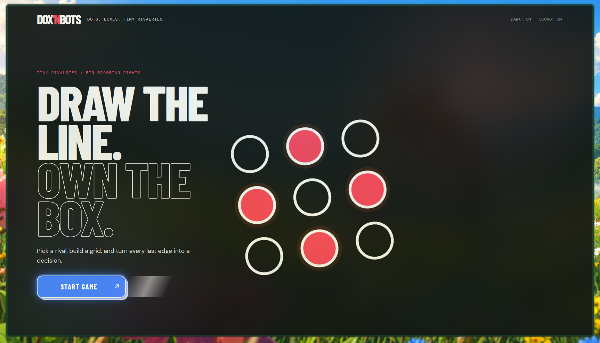
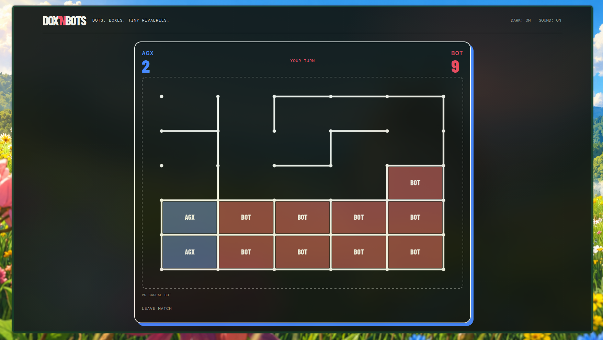

# Dox 'n Bots

A tactile, browser-based take on dots and boxes. Draw lines, claim boxes, and try not to hand the bot a chain.





## Why I built this

This is a nostalgia-driven fun project. Back in school, my mates and I used to play the classic dots and boxes game on the last pages of our notebooks — rows of dots, taking turns drawing one line at a time, fighting over who gets to close the box and scribble their initial inside.

I built Dox 'n Bots to bring that exact feeling back: pick a rival, build a grid, and turn every last edge into a decision.

Built by [AGX](https://ankushgautam.com.np) — see more at [ankushgautam.com.np](https://ankushgautam.com.np).

## MVP

- Custom grid width and height (2–10 dots each way)
- Required player name (3–50 characters)
- Noob, Casual, and God-mode bots
- Shareable remote rooms with server-authoritative WebSocket moves and reconnect support
- Fixed-screen game menu with tactile Web Audio feedback
- Local fallback leaderboard plus a FastAPI/SQLite leaderboard API

## Run locally

Run the API service for leaderboards and online rooms:

```bash
cd backend
uvicorn main:app --reload
```

Open `http://127.0.0.1:8000` after starting Uvicorn. FastAPI serves the frontend, API, and WebSocket endpoint from one origin. Without the API, solo scores remain available in browser local storage.

Online rooms are held in memory and require one Uvicorn worker. They are intentionally short-lived and do not survive a service restart.

## Test

```bash
cd backend
pytest
```
